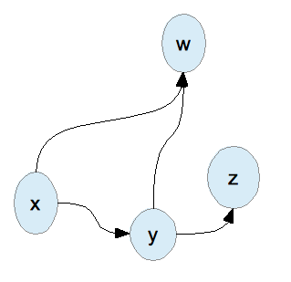
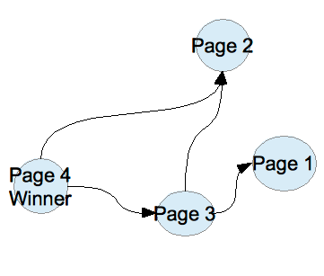
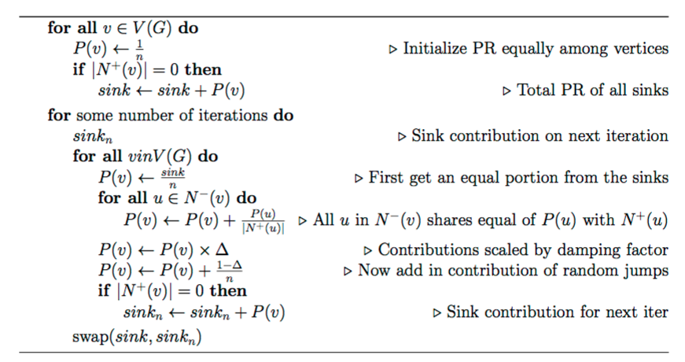
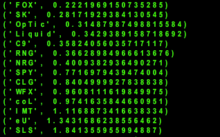

I don't play much counter strike myself-what do I look like, a nerd?-but my roommates do, and I feel like making them lose a bet next season.

The first thing to do is get some data. After the fiasco that was attempting to use javascript to skim the data off of the official website, I finally got the data from [the wiki](http://wiki.teamliquid.net/counterstrike/ESL/Pro_League/Season_4/North_America/Week_1-4) instead.

Now, how do we judge which team is the best? We might say that if Team A beats Team B and Team B beats Team C, then A can most likely beat C. But what about if y can beat teams w and z, and x can beat both y and w? The answer may be trivial to you, but as this problem expands it's clear that it's getting more and more tangled. What do we do when we need to untangle a network? We draw a graph. We will say that there is an edge y → z if y beats z in a game.

This is beginning to look a lot like PageRank. If you're unfamiliar, PageRank is the algorithm that made Google Search the powerhouse that it is today. If a webpage references another webpage by including a hyperlink to it, the referenced page is given preference since it's more likely an authority on the desired subject. The more pages that reference a page, the more preference that the reference page gets in the search ranking.

Here's a mathematical overview of the PageRank algorithm:

I coded up this algorithm in Python like so and ran a .csv of the four weeks of the North American Tournament.

def getPageranks(outDegree, inDegree, numIter):
    numVerts = float(len(outDegree))
    pageranks = {}
    pageranksNext = {}
    sumSinks = 0.0
    sumSinksNext = 0.0

    for outVertex in outDegree:
        pageranks\[outVertex\] = 1.0 / numVerts
        if (len(outDegree\[outVertex\]) == 1):
            sumSinks = sumSinks + pageranks\[outVertex\]
            
    for i in range(numIter):
        for outVertex in outDegree:
            pageranksNext\[outVertex\] = sumSinks / numVerts
            for inVertex in inDegree\[outVertex\]:
                pageranksNext\[outVertex\] += pageranks\[inVertex\] / len(outDegree\[inVertex\])
            pageranksNext\[outVertex\] \*= DAMPING\_FACTOR;
            pageranksNext\[outVertex\] += (1.0 - DAMPING\_FACTOR) / numVerts

            if (len(outDegree\[outVertex\]) == 1):
                sumSinksNext += pageranksNext\[outVertex\]

        pageranks, pageranksNext = pageranksNext, pageranks
        sumSinks = sumSinksNext
        sumSinksNext = 0.0
    return pageranks

This was my output:

The lower the PageRank, at least the way I coded it, the higher the ranking. How does it compare with the actual tournament results?

  

My Ranking

Actual Ranking

1

FOX

C9

2

SK

IMT

3

OpTic

SK

4

Liquid

OpTic

5

C9

RNG

6

RNG

NRG

7

NRG

Liquid

8

SPY

FOX

9

CLG

CLG

10

WFX

WFX

11

coL

coL

12

IMT

SLS

13

eU

SPY

14

SLS

eU

Hmm, not bad. The weirdest discrepancy is that it ranked FOX at the top instead of IMT. Why is that? Well, FOX only lost one of it's games, to NRG, while IMT lost games to eU and coL, both relatively low-ranking teams. The algorithm gives preference to FOX because so many games have it as the winner. (I later asked my roommate about this, and he told me that Echo Fox switched their team roster and their playing took a turn for the worse right at the end of the tournament, so that explains that.) In any case, this experiment showed how promising PageRank is, and I intend to try running it on the Season 5 data. If I develop it more, I might just take team roster switches into account.

The github repository for this project can be found [here](https://github.com/UuqV/GameRank).
