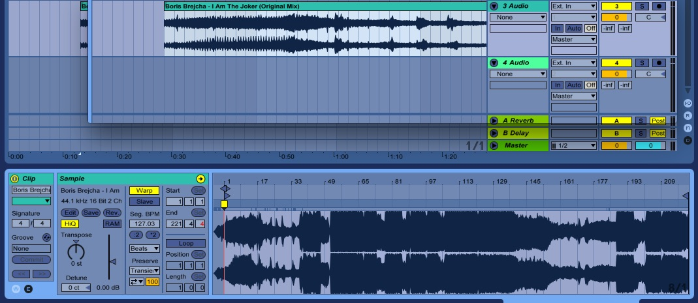
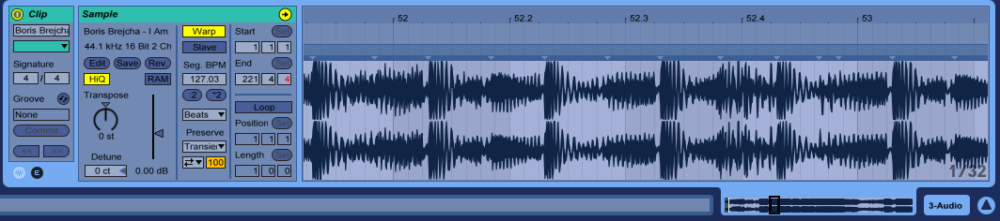
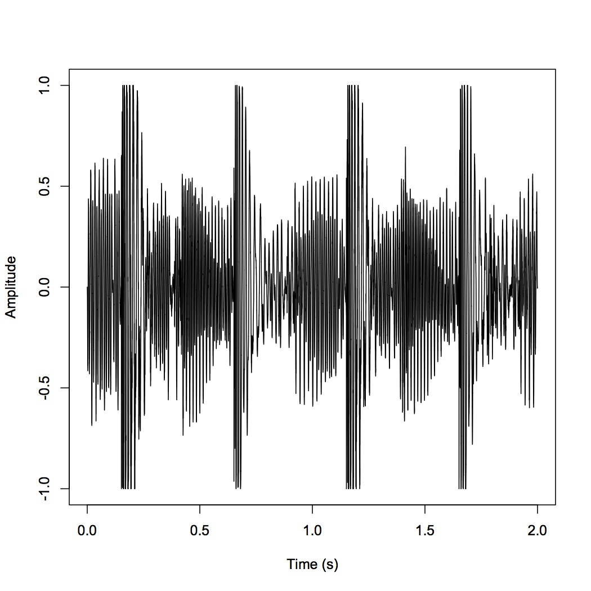

In audio processing, not to mention creation, the humble amplitude map is an indespensible tool. When you load any sound file into Ableton, the first thing Ableton does is put your track on a channel with a nice waveform view.

For example, I will use the tune [I Am The Joker](https://open.spotify.com/album/6tAGUJE3PCcsAUWe7y22hy) by Boris Brejcha. Ableton makes your audio a grabbable object, and if you click on it, you'll get a graph of amplitude over time down in the status bar.

I'm going to zoom in to the middle of the song, where most of the action is here. Now we can start to see of individual instruments in our techno track.

At first glance we can see the evidence of a banging techno kick drum, characterized by transients in this graph of amplitude over time, or how much energy our sound wave has at a given moment.

An amplitude visualization such as this is fairly simple. When trying this myself, I first wanted to quickly script it in R. Luckily, the "tuneR" library allowed me to create a workable R object containing the data from a .wav file. I'll feed it a piece of the song I used earlier.

> library(tuneR) sndObj <- readWave('Data/1IAmTheJoker.wav')

In your R interpreter, you can view your audio wave object like so:

> str(sndObj) Formal class 'Wave' \[package "tuneR"\] with 6 slots ..@ left : int \[1:88200\] 0 -23 -49 -75 -104 -135 -164 -198 -234 -260 ... ..@ right : int \[1:88200\] -1 -19 -42 -68 -94 -121 -153 -189 -215 -244 ... ..@ stereo : logi TRUE ..@ samp.rate: int 44100 ..@ bit : int 16 ..@ pcm : logi TRUE

The wave object consists of 6 "slots." For now we will look at three of them: the two channels (@left and @right), and the sample rate (@samp.rate). The left and right channels contain 88200 sample points each. The sample rate tells us that there are 44100 audio samples to every 1 ms of the song. Thus, since our song snippet is 88200 samples, it contains 2 ms worth of data. This will be useful, as this is the "over time" part of "amplitude over time." We'll store this value as "timeArray."

> timeArray <- (1:(88200)) / sndObj@samp.rate

Now, what's actually in these 88200 samples? Well, first we'll take each one in the left channel that corresponds to our x-axis.

> s1 <- sndObj@left\[1:(88200)\] / sndObj@samp.rate

Our R function returns integer-typed samples. What's the corresponding amplitude? We'll need one more value to figure that out. Namely, we'll need the bit depth of our wave file, @bit. Put simply what the bit depth tells us is that our sound sample values are mapped to integers that can range from -2^15 to (2^15)-1. Therefore, to map back to a continuous signal using a floating point value:

> s1 <- s1 / 2^(sndObj@bit - 1)

Finally, to plot the amplitude graph:

> plot(timeArray, s1, type='l', col='black', xlab='Time (s)', ylab='Amplitude')

That sure was a lot of math though, wasn't it? Well, with Web Audio you can create apps that have an analyzer without crunching the data yourself. [Here's a simple analyzer fiddle](https://jsfiddle.net/8mptzws0/50/) I created that allows you to upload a file and view its (animated) waveform.

This is an intriguing way to compare the design decisions of programming languages that are intended for entirely different purposes. With R, the script ends up overall much shorter and faster to write, but R is best for documents like the plot above. In Javascript, I had to write much more code simply to make my data useable and viewable, but this is unsurprising. Since Javascript is developed to create web applications, the authors chose to abstract away the math that I did in R, and instead expose interface design for modification. R instead offers me intimacy with the mathematics, but abstracts away the data parsing and visualization. This can be nice when exploring the data, but this would make trying to develop a powerful WebApp insufferable.
