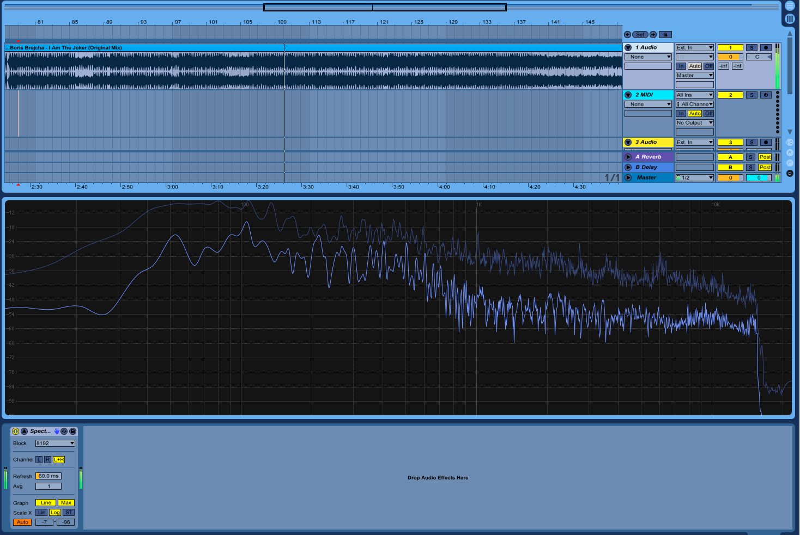
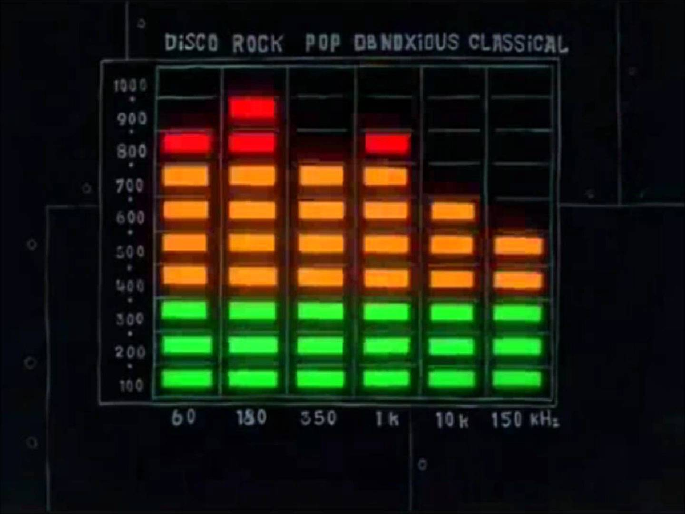
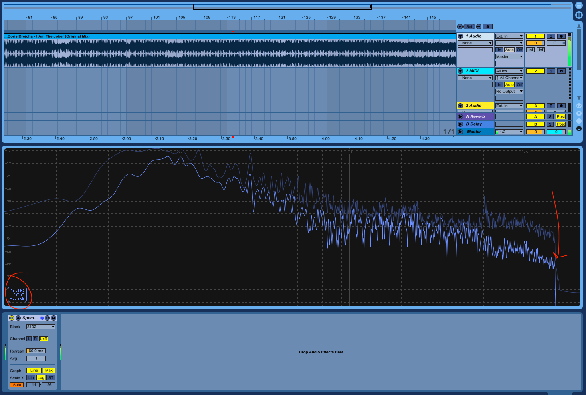
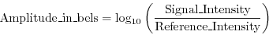
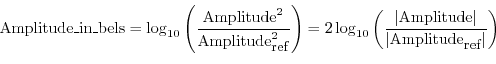
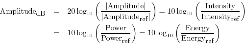
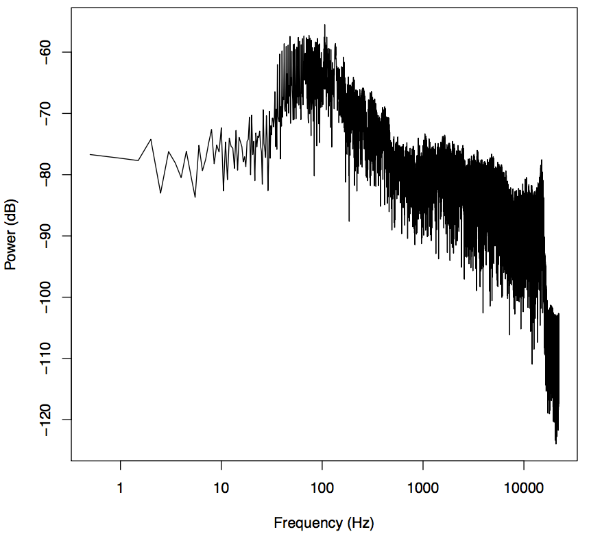
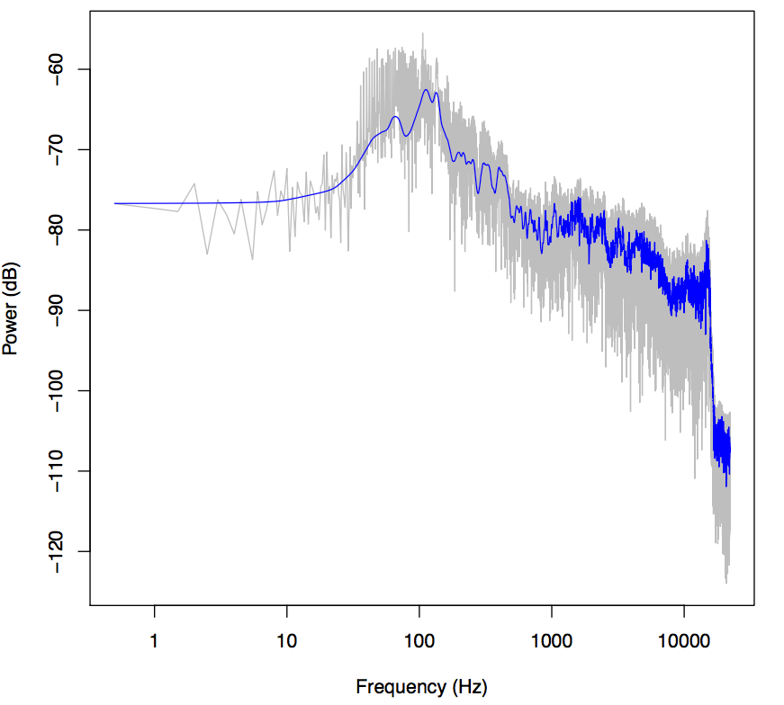
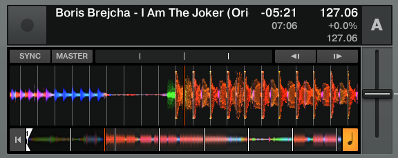
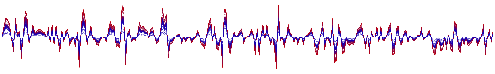

The Fast Fourier Transform is an indispensible fundamental in most signal processing. Audio signals are no exception.

Fundamentally, the FFT is used to graph a signal with respect to frequency, as opposed to its original domain. It allows us to separate different components of our signal from each other, thus we can create a "tone spectrum" when we apply it to audio.

Ableton's "Spectrum" audio effect does this in real time for you. Your output looks like this:



This might seem inscrutable, but most people have seen the fft used in this context. To most, it looks like this:



The fft separates the signal into discrete frequency "bins." It can be very useful analytically to look at frequencies in large bands of perhaps 1000Hz. When those bins get sufficiently granular, you can reconstruct an effectively continuous function like the one in Ableton.

Scrutinizing the FFT can have many uses. To aquaint you we'll look at one.

### The FFT as a Sound Quality Test

We can analyize the quality of the sound file simply by looking at the tone spectrum. We can see that our output cuts off sharply at 16 kHz:



This is the [frequency cutoff at 128 kbps with mp3 compression](https://thesession.org/discussions/19642). From this you can infer the original quality of your file. If your file was originally a 128 kbps mp3, was then converted to a wav (which is lossless) and compressed back into a 256 kbps mp3, the file metadata would say that the bitrate was 256 kbps. Although the final mp3 file may have the capacity for another 128 kbps, the original file would have had no data to fill those remaining slots. You can tell if those slots are empty--and if your file browser is lying to you--by using the FFT to look at them.

## In R

Let's find out how we can make this. To start processing our sound clip in R, we do the same thing we did [when we extracted the amplitude data from a sound file](https://kathrynlovell.tech/2017-09-23-audio-frequency-and-amplitude-maps-in-r-vs-the-web-audio-api/). We get the time domain and amplitude of our audio file by dividing the array of samples by the sample rate and (since the wav format has the audio values mapped to integers) convert to float values.

```
s1 <- sndObj@left[1:(88200)] / sndObj@samp.rate
s1 <- s1 / 2^(sndObj@bit -1)

timeArray <- (1:(88200)) / sndObj@samp.rate
```

The values in s1 correspond to the amplitude of the waveform, the range of our function. timeArray is our time domain. When we take the fft of the amplitude values over time, a.k.a. s1, we will get back the same amplitude values, but instead mapped with the frequency as the domain. You do this in R simply by calling

```
p <- fft(s1)
```

So, right now p holds our new y-axis. But these amplitude values mean something only to each other. Let's convert it to something more meaningful. A _decibel_ is one tenth of a _bel_, an amplitude unit defined for sound as the log<sub>10</sub> of the intensity of the wave [relative to some](https://www.dsprelated.com/freebooks/mdft/Decibels.html) [reference intensity](https://www.dsprelated.com/freebooks/mdft/Decibels.html).



The choice of reference intensity (or power) defines the particular choice of _dB scale_. Signal intensity, power, and energy are always proportional to the _square_ of the signal _amplitude_. Thus, we can always translate these energy-related measures into squared amplitude:



Since there are 10 decibels to a bel,



To get the dB value of our amplitude value, we will transform our y-axis data as such:

```
y <- 10*log10(p)
```

Finally, we can graph our frequency data:

```
plot(x, y, type='l', col='black', xlab='Frequency (kHz)', ylab='Power (dB)')
```


This certainly looks like frequency readout from the file--we can see the drastic dip at 16Hz we saw before--but this doesn't much look like our Ableton output.

Ableton and Bell know something we don't. Likely much like you, when I listen to a sound I care a ton about what's happening in the 10-5,000Hz range, and especially the 10-100Hz range, that's where all the bass and kicks are. Relatively you and I don't care so much about the 15,000Hz-20,000Hz range because (whoa!) most human perception response curves are logarithmic. Naturally, then, we should give our x-axis a logarithmic scale instead, it'll give us a better view of the bass tones. We do this in R simply by adding the argument log='x', denoting that the x-axis of the graph is in the logarithmic scale, like so:

```
plot(x, y, log='x', type='l', col='black', xlab='Frequency (kHz)', ylab='Power (dB)')
```



Ooh there it is.

### Loess()

These graphs sure are hairy. But any piece of music is going to have harmonics everywhere. They can make your sound great, but they can make it hard to see the overall trends in your frequency graph.

We'll employ R's smoothing function [lowess()](https://stat.ethz.ch/R-manual/R-devel/library/stats/html/lowess.html) to make it easier to see the big picture.

```
lines(lowess(x, y, f=.001,delta=.0001,iter=5), col='blue')
```

Parameters f, delta, and iter influence what your output will look like in important ways. Parameter f is the smoother span, and thus it should be relatively small so that we can still distinguish individual sounds. But ultimately these parameters' effect on the graph is in the eye of the beholder.



## Dynamic FFT Displays

Here we will once again explore the many applications of the FFT. While Ableton's waveform thumbnails show overall amplitude, Native Instrument's Traktor uses color to add another analytic depth to the amplitude chart. The color of the waveform indicates the frequency of the tone at that point. This is very useful as DJ functionality, as it's a compact way to convey the most important information about a song in a way that you can read visually. With this you can practically know what the song sounds like having never heard it before.



### Analyzing Audio Using FFT With WebAudio

I regret to inform you that this fft trick involves the same amount of math in JavaScript. You're not missing much though, the FFT is more or less a [big recursive matrix operation](https://en.wikipedia.org/wiki/Cooley–Tukey_FFT_algorithm). Believe me, whether you understand it or not, you want the computer to do it. In the R pretty much all we did is run a method called "fft," and that's pretty much exactly what we'll do with Web Audio.

You can use a Context just like we made in the waveform tutorial. It'll come in handy later anyway. Say you've got an Audio Context set up like such:

```
var audioContext = new AudioContext();
var analyser = audioContext.createAnalyser();
analyser.minDecibels = -90;
analyser.maxDecibels = -10;
analyser.smoothingTimeConstant = 0.85;

```

Simply tell the analyzer how many frequency bins you want, and we'll be in business.

```
analyser.fftSize = 512; var bufferLength = analyser.fftSize;
```

While the R fft function can be performed on any size data range, the Web Audio API fast fourier transform function returns the fft on simply the instantaneous time domain. In other words, where before the data from the entire sound clip and put it into one frequency graph, giving us more of a total count in our frequency bins. But the fact that Web Audio only gives us the instantaneous transform will come in handy for what we're about to do.

```
var overallAmp = new Float32Array(analyser.fftSize);
analyser.getFloatTimeDomainData(overallAmp);
```

Just like in our waveform tutorial, we'll call getFloatTimeDomainData() on overallAmp to get the waveform centered around the current looping Audio Context. Once we have this,

```
var fftValues = new Float32Array(analyser.frequencyBinCount);

analyser.getFloatFrequencyData(fftValues);
```

This is a useful difference, as this allows a Web Audio user to create an fft visualization completely in sync with the page's Audio Context. The transform created by this function will show us the frequencies we would hear in real time.

### Rendering our Multi-Dimensional Visualizer

However you source your audio in javascript, make sure that you pass it to your Audio Context, and that everything is within the scope of the decodedData. You can do this like so:

```
var source = audioContext.decodeAudioData(e.target.result, function(decodedData) {
    source = audioContext.createBufferSource();
    source.buffer = decodedData;
    source.connect(analyser);
    source.loop = true;
    source.start();

    draw();
});
```

Once draw is called within the context, we'll truly get to creating our visualizer.

```
var overallAmp = new Float32Array(analyser.fftSize);
analyser.getFloatTimeDomainData(overallAmp);
drawVisual = requestAnimationFrame(draw);
toDraw = new Float32Array(bufferLength);
var fftValues = new Float32Array(analyser.frequencyBinCount);
```


